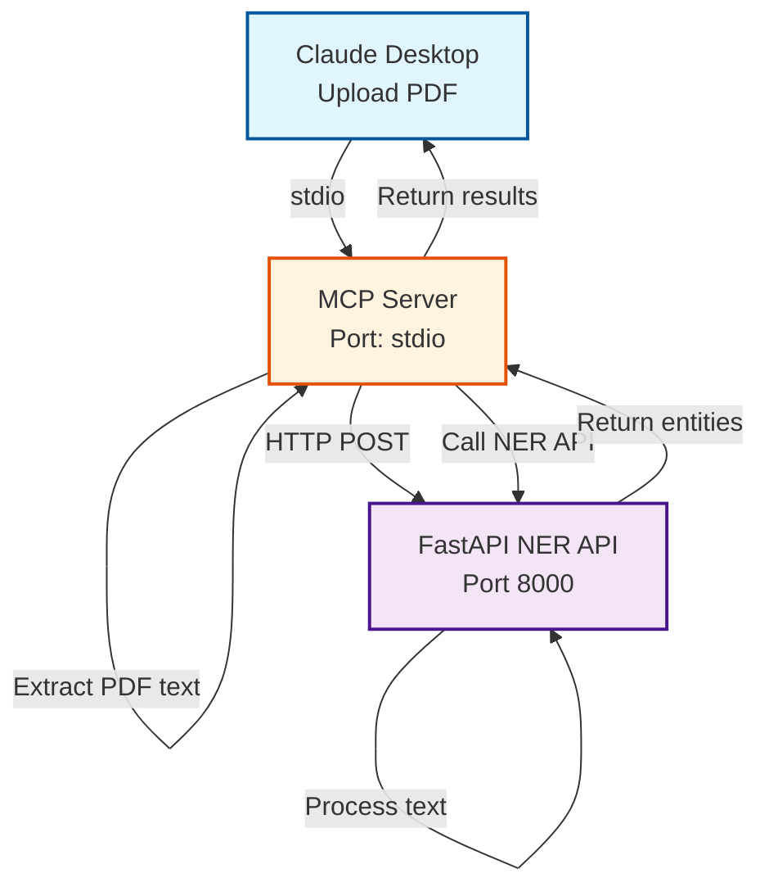
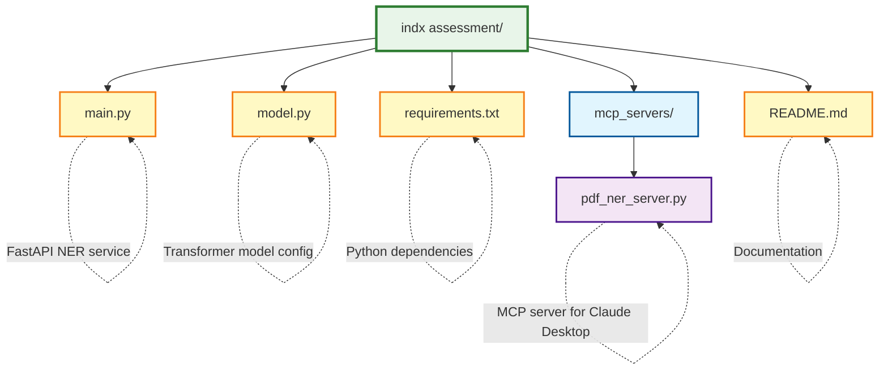

# PDF NER Extractor with MCP Server

A FastAPI-based Named Entity Recognition (NER) service integrated with an MCP (Model Context Protocol) server for Claude Desktop. This project enables Claude Desktop to extract text from PDF files and perform NER analysis using a transformer-based model.

## Features

- **FastAPI NER Service**: RESTful API for Named Entity Recognition using HuggingFace transformers
- **MCP Server Integration**: Seamless integration with Claude Desktop via Model Context Protocol
- **PDF Text Extraction**: Automatic text extraction from PDF documents
- **Entity Recognition**: Identifies entities such as persons, organizations, locations, and more
- **Real-time Analysis**: Process text and PDFs on-the-fly through Claude Desktop

## Architecture



## Project Structure



## Prerequisites

- Python 3.10 or higher
- Claude Desktop application
- Windows/macOS/Linux

## Installation

### 1. Clone or Navigate to the Project Directory

```bash
cd "NER-for-claude"
```

### 2. Install Python Dependencies

```bash
C:\Python312\python.exe -m pip install -r requirements.txt
```

### 3. Required Dependencies

The `requirements.txt` includes:
- `fastapi` - Web framework for the NER API
- `pydantic` - Data validation
- `transformers` - HuggingFace transformer models
- `torch` - PyTorch for ML models
- `fastmcp` - MCP server framework
- `PyPDF2` - PDF text extraction
- `httpx` - Async HTTP client
- `uvicorn` - ASGI server

## Configuration

### 1. Start the FastAPI NER Service

The NER API must be running before using the MCP server. Start it with:

```bash
uvicorn main:app --host localhost --port 8000 --reload
```

The API will be available at:
- Base URL: `http://localhost:8000`
- API Documentation: `http://localhost:8000/docs`
- Interactive API: `http://localhost:8000/redoc`

### 2. Configure Claude Desktop

#### Find Your Config File

**Windows:**
```
%APPDATA%\Claude\claude_desktop_config.json
```

**macOS:**
```
~/Library/Application Support/Claude/claude_desktop_config.json
```

**Linux:**
```
~/.config/Claude/claude_desktop_config.json
```

#### Add MCP Server Configuration

Edit the `claude_desktop_config.json` file and add:

**If using System Python (C:\Python312):**
```json
{
  "mcpServers": {
    "pdf-ner-extractor": {
      "command": "python",
      "args": [
        "C:\\your\\file\\path\\NER-for-claude\\mcp_servers\\pdf_ner_server.py"
      ]
    }
  }
}
```

**Important Notes:**
- Use double backslashes `\\` in Windows paths
- Adjust the path to match your actual project location
- If you already have other MCP servers, add the `pdf-ner-extractor` entry to the existing `mcpServers` object

#### If You Have Existing MCP Servers:

```json
{
  "mcpServers": {
    "existing-server": {
      "command": "...",
      "args": ["..."]
    },
    "pdf-ner-extractor": {
      "command": "C:\\Python312\\python.exe",
      "args": [
        "C:\\your\\file\\path\\NER-for-claude\\mcp_servers\\pdf_ner_server.py"
      ]
    }
  }
}
```

### 3. Restart Claude Desktop

After saving the configuration:
1. Completely quit Claude Desktop (not just close the window)
2. Restart Claude Desktop
3. The MCP server will start automatically when Claude Desktop launches

## Usage

### Available Tools in Claude Desktop

Once configured, Claude Desktop will have access to three MCP tools:

#### 1. `analyze_pdf_ner`

Extract text from a PDF file and perform NER analysis.

**Example Usage:**
```
Upload a PDF file and say:
"Can you analyze this PDF for named entities?"
```

**What it does:**
- Decodes the PDF content
- Extracts text from all pages
- Identifies entities (persons, organizations, locations, etc.)
- Returns entity details with scores and positions

**Response includes:**
- Extracted text
- Text length
- List of identified entities with:
  - Entity type (PERSON, ORG, LOC, etc.)
  - Confidence score
  - Word/phrase
  - Position in text (start/end indices)
- Total entity count

#### 2. `analyze_text_ner`

Perform NER analysis on plain text.

**Example Usage:**
```
"Analyze this text for named entities:
'Apple Inc. is headquartered in Cupertino, California.
Tim Cook is the CEO.'"
```

**What it does:**
- Takes text input directly
- Performs NER analysis
- Returns identified entities

#### 3. `check_api_status`

Check if the FastAPI NER service is running and accessible.

**Example Usage:**
```
"Is the NER API server running?"
```

**What it does:**
- Tests connection to the FastAPI server
- Returns server status and availability

### Example Workflows

#### Workflow 1: Analyze a PDF Document

1. Start the FastAPI server:
   ```bash
   uvicorn main:app --host localhost --port 8000 --reload
   ```

2. Open Claude Desktop

3. Upload a PDF file

4. Ask Claude:
   ```
   "Please analyze this PDF and extract all named entities.
   Show me the people, organizations, and locations mentioned."
   ```

5. Claude will use the `analyze_pdf_ner` tool to:
   - Extract text from the PDF
   - Call the NER API
   - Present the results in a readable format

#### Workflow 2: Quick Text Analysis

1. Make sure the FastAPI server is running

2. In Claude Desktop, type:
   ```
   "Analyze this contract excerpt for entities:

   This Agreement is entered into by Microsoft Corporation,
   located in Redmond, Washington, and John Smith,
   residing in New York, New York."
   ```

3. Claude will use `analyze_text_ner` to identify:
   - Microsoft Corporation (Organization)
   - Redmond (Location)
   - Washington (Location)
   - John Smith (Person)
   - New York (Location)

#### Workflow 3: System Health Check

```
"Can you check if the NER API is currently running?"
```

Claude will use `check_api_status` and report the connection status.

## API Documentation

### FastAPI Endpoint

#### `POST /ner`

Performs Named Entity Recognition on the provided text.

**Request Body:**
```json
{
  "query": "Your text to analyze"
}
```

**Response:**
```json
[
  {
    "entity": "B-PER",
    "score": 0.9987,
    "index": 1,
    "word": "John",
    "start": 0,
    "end": 4
  },
  {
    "entity": "I-PER",
    "score": 0.9985,
    "index": 2,
    "word": "Smith",
    "start": 5,
    "end": 10
  }
]
```

**Entity Types:**
- `B-PER` / `I-PER` - Person names (Beginning/Inside)
- `B-ORG` / `I-ORG` - Organizations
- `B-LOC` / `I-LOC` - Locations
- `B-MISC` / `I-MISC` - Miscellaneous entities

**Test the API directly:**
```bash
curl -X POST "http://localhost:8000/ner" \
  -H "Content-Type: application/json" \
  -d "{\"query\": \"Apple Inc. is in Cupertino\"}"
```

Or visit the interactive docs at: `http://localhost:8000/docs`

## Model Information

The project uses the HuggingFace transformers library with a pre-trained NER model:

- **Task**: Named Entity Recognition
- **Framework**: PyTorch + Transformers
- **Default Model**: `dbmdz/bert-large-cased-finetuned-conll03-english`
- **Model File**: `model.py:5`

To change the model, edit `model.py:5`:
```python
pipe = pipeline("ner", model="your-preferred-ner-model")
```

## Troubleshooting

### Issue: "ModuleNotFoundError: No module named 'fastmcp'"

**Solution:** Install dependencies in the correct Python environment:
```bash
# If using System Python
\Python312\python.exe -m pip install -r requirements.txt

# If using Anaconda
C:\path\python.exe -m pip install -r requirements.txt
```

### Issue: "Could not attach MCP server" in Claude Desktop

**Check:**
1. Verify the Python path in `claude_desktop_config.json` is correct
2. Ensure all dependencies are installed
3. Check Claude Desktop logs:
   - Windows: `%APPDATA%\Claude\logs`
   - macOS: `~/Library/Logs/Claude`
   - Linux: `~/.config/Claude/logs`

### Issue: "Cannot connect to NER API"

**Check:**
1. FastAPI server is running: `http://localhost:8000/docs`
2. Port 8000 is not being used by another application
3. Use the `check_api_status` tool in Claude Desktop

### Issue: PDF text extraction fails

**Possible causes:**
1. PDF is password-protected
2. PDF contains only scanned images (no text layer)
3. PDF is corrupted

**Solutions:**
1. Remove password protection
2. Use OCR software to add text layer
3. Try a different PDF file

### Issue: Port 8000 already in use

**Solution:** Change the port in both places:

1. Start FastAPI on a different port:
   ```bash
   uvicorn main:app --host localhost --port 8001 --reload
   ```

2. Update the MCP server (`mcp_servers/pdf_ner_server.py:19`):
   ```python
   FASTAPI_URL = "http://localhost:8001"
   ```

## Development

### Running Tests

Test the FastAPI endpoint:
```bash
# Start the server
uvicorn main:app --host localhost --port 8000

# Test with curl
curl -X POST "http://localhost:8000/ner" \
  -H "Content-Type: application/json" \
  -d "{\"query\": \"Tim Cook works at Apple in California\"}"
```

### Modifying the MCP Server

The MCP server is located at `mcp_servers/pdf_ner_server.py`.

After making changes:
1. Save the file
2. Restart Claude Desktop (it will restart the MCP server automatically)

### Adding New Tools

To add a new MCP tool, edit `pdf_ner_server.py`:

```python
@mcp.tool()
async def your_new_tool(
    param: Annotated[str, "Parameter description"]
) -> Annotated[dict, "Return value description"]:
    """
    Tool description that Claude will see
    """
    # Your implementation
    return {"result": "value"}
```

## Performance Notes

- **First API call**: May take 10-30 seconds as the model loads into memory
- **Subsequent calls**: Typically < 1 second for short texts
- **Large PDFs**: Processing time increases with document size
- **Memory**: The transformer model requires ~2GB RAM

## Security Considerations

- The API runs on localhost only (not exposed to external networks)
- No authentication is implemented (suitable for local development)
- PDF files are processed in memory (not saved to disk)
- For production use, add authentication and HTTPS

## License

This project is provided as-is for educational and development purposes.

## Support

For issues related to:
- **FastAPI**: Check the API logs in the terminal
- **MCP Server**: Check Claude Desktop logs
- **Model Issues**: Refer to HuggingFace transformers documentation

## Contributing

To contribute to this project:
1. Test your changes thoroughly
2. Update documentation
3. Ensure all dependencies are listed in `requirements.txt`

## Acknowledgments

- Built with [FastAPI](https://fastapi.tiangolo.com/)
- Uses [HuggingFace Transformers](https://huggingface.co/docs/transformers)
- MCP integration via [FastMCP](https://github.com/jlowin/fastmcp)
- PDF processing with [PyPDF2](https://pypdf2.readthedocs.io/)

---

**Quick Start Summary:**

```bash
# 1. Install dependencies
pip install -r requirements.txt

# 2. Start FastAPI server
uvicorn main:app --host localhost --port 8000 --reload

# 3. Configure Claude Desktop (see Configuration section)

# 4. Restart Claude Desktop

# 5. Upload a PDF and ask Claude to analyze it!
```
